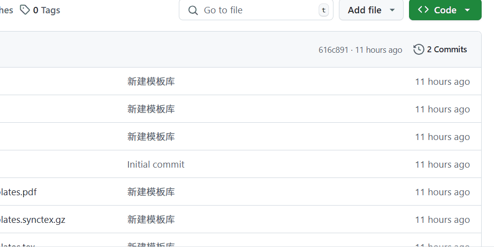

# mnnuacmer-CP-templates

## 下载
- 方式一：使用 `git` 下载。
          `git clone https://github.com/1110AnRan/mnnuacmer-CP-templates.git`
- 方式二：直接下载压缩包。

## 使用

### 安装Tex Live
请预先下载 `Tex Live` 并添加到对应的环境变量中，请参考[官方文档](https://www.tug.org/texlive/quickinstall.html)。

- 下载链接一：[官方](https://tug.org/texlive/)
- 下载链接二：[清华镜像](https://mirrors.tuna.tsinghua.edu.cn/CTAN/systems/texlive/Images/)

### VS Code(建议)
安装 `LaTex Workshop` 扩展，对于环境配置请参考[官方文档](https://github.com/James-Yu/LaTeX-Workshop?tab=readme-ov-file)。
配置完成后，建议使用 `xelatex` 编译。

## 备注
- 由于是第一个管理仓库，如有不足的地方请大家指出。

##  声明
- 部分内容整理来自互联网，如有侵权，请第一时间联系。

## 联系
- Email：[2791158256@qq.com](https://wx.mail.qq.com/?cancel_login=true&from=get_ticket_fail) 或者 [xiaojianhua493@gmail.com](https://mail.google.com/)
- WeChat：添加好友时请备注说明

